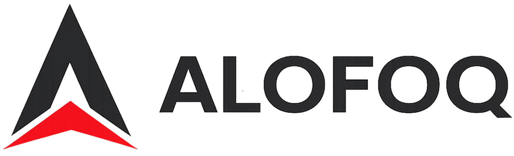
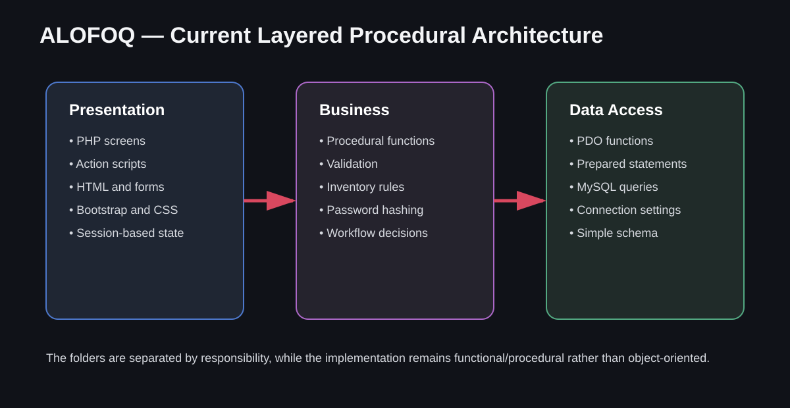
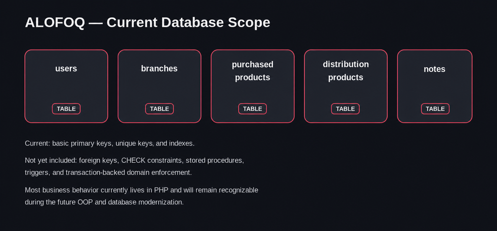

<p align="center">
  
</p>

# ALOFOQ Distribution Management System

ALOFOQ is a small web-based distribution and inventory management project built as a practical learning application. It manages purchased products, branches, product distribution, basic statistics, user profiles, notes, and cross-module search through an Arabic, responsive interface.

The project intentionally uses a **simple functional/procedural PHP style rather than object-oriented programming**. Its current goal is to keep the flow easy to follow: a screen submits to an action, the action calls business functions, and the business layer calls PDO-based data-access functions.

> This repository represents the current learning version of the system. It is useful for studying layered organization, PHP forms, sessions, PDO, MySQL, validation, inventory workflows, and gradual refactoring.

## Main Features

- User login, logout, profile display, profile editing, image upload, and password reset
- Dashboard with high-level navigation
- Import and management of purchased products
- Branch creation, update, deletion, and image management
- Product distribution from central stock to branches
- Product and branch selection workflows
- Search across important project data
- Basic sales and inventory statistics
- Contact notes stored in the database
- Responsive Arabic user interface

## Demo Login

Import the database file included in this repository, then use any of these demo accounts:

| Username  | Password    |
| --------- | ----------- |
| `Ahmed26` | `Abcd1234$` |
| `Hamed26` | `Abcd1234$` |
| `Omar25`  | `Abcd1234$` |

The SQL seed in `DataAccess/CreatedDB/basic_dgs_db.sql` contains the SHA-256 hash for this demo password.

**Important:** These credentials are only for local demonstration. Change them before using the project outside a development environment.

## Technologies Used

| Area                 | Technology                                             |
| -------------------- | ------------------------------------------------------ |
| Backend              | PHP with procedural/functional code                    |
| Database             | MySQL                                                  |
| Database access      | PHP PDO and prepared statements                        |
| Frontend             | HTML5, CSS3, and small amounts of JavaScript           |
| UI framework         | Bootstrap 5.3.2                                        |
| Icons                | Bootstrap Icons                                        |
| Authentication state | PHP sessions                                           |
| File storage         | Local upload folders for users, products, and branches |

The Bootstrap files and icons are loaded from a CDN, so an internet connection is needed for the complete styling unless they are downloaded locally.

## Architecture

<p align="center">
  
</p>

The code is physically organized into three main layers:

### 1. Presentation Layer

Located in `Presentation/`.

It contains:

- `Screens/` for the visible PHP pages
- `actions/` for form handling, redirects, and workflow coordination
- `includes/` for shared authentication, header, and footer code
- `assests/` for CSS and images

The presentation layer reads form values, uses session variables, calls business functions, and renders the result.

### 2. Business Layer

Located in `Business/`.

It contains procedural functions grouped by feature, such as users, branches, purchased products, distributed products, notes, and statistics. This layer contains most validation and business decisions, including password hashing and inventory-related checks.

This is **not an OOP domain layer**. The files use standalone PHP functions. The folder separation still provides a simple boundary between user-interface logic and database logic.

### 3. Data Access Layer

Located in `DataAccess/`.

It contains the PDO connection and feature-specific query functions. Prepared statements are used for many values, and query results are returned to the business layer as arrays.

### Request Flow

A typical request follows this path:

```text
Browser
  -> PHP Screen
  -> Action Script
  -> Business Function
  -> Data-Access Function
  -> PDO / MySQL
  -> Result returned through the same layers
  -> Redirect or rendered page
```

## Database Design

<p align="center">
  
</p>

The database is intentionally simple and contains five main tables:

- `users`
- `branches`
- `purchased_products`
- `distribution_products`
- `notes`

The current schema includes basic primary keys, selected unique keys, and indexes. It does **not** currently include:

- Foreign-key constraints
- `CHECK` constraints
- Stored procedures
- Triggers
- Database-enforced relationship rules
- A complete transaction strategy for multi-step workflows

Relationships such as a distributed product belonging to a branch or purchased product are represented by identifier columns, but they are mainly trusted and managed by the PHP application rather than enforced by MySQL.

This keeps the first version easy to understand, but it also means invalid or orphaned data can be created when application validation is bypassed. The project should therefore be treated as an educational or local-development system, not a production-ready inventory platform.

## Business Rules

Most current business rules live in PHP. Important examples include:

- A user must provide valid credentials before accessing protected screens.
- Password input is converted to a SHA-256 hash before database comparison or update.
- Product quantities are checked and updated during distribution workflows.
- Branch, product, and user input is validated before data-access functions are called.
- Uploaded images are stored in feature-specific folders and their file names are stored in the database.
- Session variables preserve the current user and temporary multi-page distribution state.
- Search and statistics operations use selected, application-controlled fields.

During modernization, most recognizable business behavior should remain the same. The implementation will change, but users should continue to experience the same core workflows unless a rule is deliberately improved.

## Project Structure

```text
.
├── Business/
│   ├── Branch.php
│   ├── DistributionProduct.php
│   ├── Note.php
│   ├── PurchasedProduct.php
│   ├── Statistics.php
│   ├── User.php
│   └── Business_Utils.php
├── DataAccess/
│   ├── CreatedDB/basic_dgs_db.sql
│   ├── Settings.php
│   └── *_DataAccess.php
├── Presentation/
│   ├── Screens/
│   ├── actions/
│   ├── includes/
│   └── assests/
├── uploads/
│   ├── branches/
│   ├── products/
│   ├── temp/
│   └── users/
├── readme/
│   ├── alofoq-logo.png
│   ├── architecture.svg
│   └── database.png
└── README.md
```

## Documentation

Additional technical documentation is included in the repository for readers who want a more detailed understanding of the system design, architecture, and database.

### Database Documentation

A detailed description of the database schema, tables, columns, relationships, and design decisions is available here:

- 📄 [`docs/db_docs/basic_dgs_db_Documentation.docx`](docs/db_docs/basic_dgs_db_Documentation.docx)

### Project Technical Documentation

A comprehensive technical document describing the overall project architecture, modules, workflows, and implementation details is available here:

- 📄 [`docs/website_docs/ALOFOQ_Project_Technical_Documentation.docx`](docs/website_docs/ALOFOQ_Project_Technical_Documentation.docx)

These documents complement this README and provide more in-depth information for developers, students, and contributors who want to understand or extend the project.

## Local Setup

### Requirements

- PHP 8.x with PDO MySQL enabled
- MySQL 8.x or a compatible version
- Apache through XAMPP, WAMP, Laragon, or a similar local server
- A browser

### Installation

1. Clone or download the repository.
2. Because the current code contains absolute paths, place the project src folder at:

   ```text
   <web-root>/
   ```

   For XAMPP on Windows, the common path is:

   ```text
   C:/xampp/htdocs/
   ```

3. Create/import the database using:

   ```text
   DataAccess/CreatedDB/basic_dgs_db.sql
   ```

4. Confirm the database configuration in `DataAccess/Settings.php`:

   ```php
   $ConnectionString = "mysql:host=localhost;dbname=basic_dgs_db";
   $UserName = "root";
   $Password = "";
   ```

5. Make sure PHP can write to the folders inside `uploads/`.
6. Start Apache and MySQL.
7. Open:

   ```text
   http://localhost/src/Presentation/Screens/Login%20Screens/login.php
   ```

8. Sign in using one of the demo accounts listed above.

## Current Technical Limitations

The current version is deliberately straightforward, but several areas should be improved before production use:

- Procedural code makes large workflows harder to extend and test.
- URLs and redirects contain hard-coded project paths.
- Database credentials are stored directly in source code.
- SHA-256 alone is not suitable for password storage; `password_hash()` and `password_verify()` should be used.
- Login currently sends credentials using a GET request and should be changed to POST.
- The schema uses MyISAM, which does not support foreign keys or transactions.
- Referential integrity is not enforced by the database.
- Multi-query inventory operations need transactions and concurrency protection.
- Authorization roles and permissions are not implemented.
- CSRF protection, centralized validation, and systematic output encoding should be strengthened.
- Upload validation and storage should be hardened.
- Automated tests are not included.

## Future Roadmap

The planned modernization will be incremental rather than a complete rewrite of the product behavior.

### Backend Modernization

- Convert backend features from procedural functions to OOP services, repositories, entities/value objects, and controllers
- Introduce dependency injection and clear interfaces
- Replace hard-coded paths and settings with centralized configuration and environment variables
- Add consistent request validation and exception handling
- Introduce reusable authentication and authorization services
- Add unit, integration, and workflow tests

### Database Improvements

- Move tables from MyISAM to InnoDB
- Add foreign keys for real relationships
- Add suitable `CHECK` constraints and safer column types
- Add transactions for distribution and inventory updates
- Review indexes using actual query patterns
- Add audit fields and, where useful, audit logging
- Introduce stored procedures or triggers only where they provide a clear benefit; business logic should not be moved into the database without a strong reason
- Add migrations and seed scripts

### Preserving Business Behavior

Most business rules and user workflows are expected to stay recognizable during the refactor. The main change will be **where and how the rules are implemented**, not an unnecessary change to what the application does.

For example, the product-distribution workflow can keep the same quantity checks and screen sequence while moving the logic into an OOP application service and executing all database changes inside one transaction.

## Repository Purpose

This repository is suitable for:

- Learning procedural PHP and PDO
- Understanding a simple layered project structure
- Practicing business-rule separation
- Studying database limitations before adding integrity constraints
- Refactoring a working procedural application into an OOP architecture
- Comparing a basic database design with a future production-oriented design

## Contributing

Contributions are welcome, especially changes that improve the code without hiding the learning path. Keep pull requests focused, explain changed business behavior, and avoid mixing a large architectural rewrite with unrelated UI changes.

## Disclaimer

This project is a learning implementation. Review its authentication, database integrity, uploads, authorization, and deployment configuration before using it with real users or real business data.
